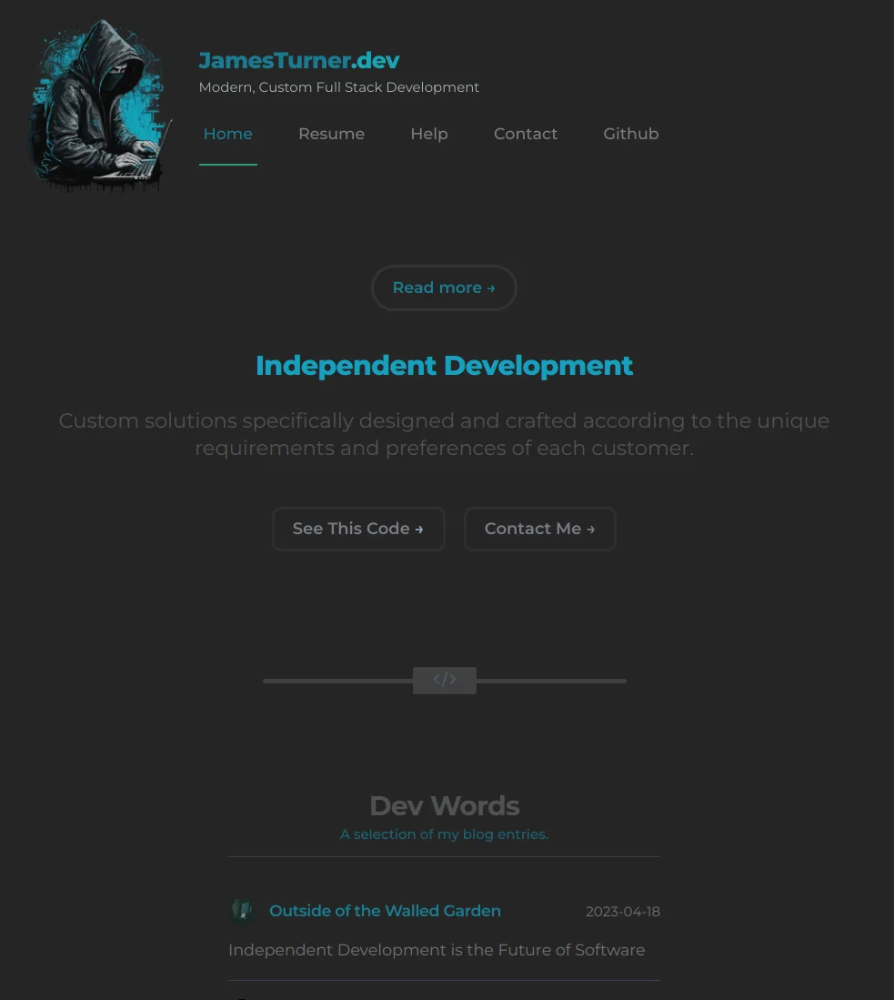

## Front-End.us   : 0.1.3
##### [https://front-end.us/](https://front-end.us)

##### Front-End.us is a repository that I use to bootstrap my projects.  It is built with the following technologies:

- [Vite](https://vitejs.dev/)
- [Vue3](https://v3.vuejs.org/)
- [TailwindCSS](https://tailwindcss.com/)
- [HeadlessUI](https://headlessui.dev/)

I found myself building the same frontend components over and over again. So I decided to build a set of frontend Views and components that I can use to bootstrap my projects more efficinently.  I decided to open source it so that others can benefit from it as well.  I hope you enjoy it.

I will be adding more components as I build them. In addition to the landing, faq, login, and register pages I usually need an admin section so I think that will be next. If you have any suggestions, please feel free to open an issue or submit a pull request.




### Installation

```bash
npm install
```

### Usage

```bash
npm run dev
```

### Build

```bash
npm run build
```

### More Help and information
There is a question and answer section on the site: 
[Front-End.us Help](https://front-end.us/page/help)

You can also open an issue on the repo.

### Todo List

- Change out all script to script setup
- Finish creating custom CSS
- Add tests
- Add documentation
- Fix the current page in the menu?
- 99% or better Lighthouse score ( so close !)

### License
Copyright 2023 [James Turner Dev](https://james-turner.dev)
This project is licensed under the MIT License - see the [LICENSE](LICENSE) file for details